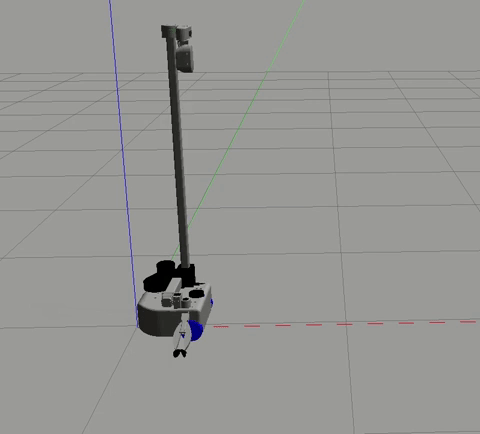

## Example 1




The goal of this example to give you an enhance understanding how to control the mobile base by sending `Twist` messages to a Stretch robot.

First, bringup [Stretch in the empty world simulation](getting_started). Open a new terminal and go into the *src* folder where the [move](src/move.py) node is located. To drive the robot forward, type the following in the terminal.

```
python move.py
```
This will drive the robot forward ...


```python
#!/usr/bin/env python

# Every python controller needs these lines
import rospy

# The Twist message is used to send velocities to the robot.
from geometry_msgs.msg import Twist

class Move:
	def __init__(self):
		# Setup a publisher that will send the velocity commands for the Stretch
		# This will publish on a topic called "/stretch_diff_drive_controller/cmd_vel"
		# with a message type Twist.
		self.pub = rospy.Publisher('/stretch_diff_drive_controller/cmd_vel', Twist, queue_size=1)

	def move_forward(self):
		# Make a Twist message.  We're going to set all of the elements, since we
		# can't depend on them defaulting to safe values.
		command = Twist()

		# A Twist has three linear velocities (in meters per second), along each of the axes.
		# For Stretch, it will only pay attention to the x velocity, since it can't
		# directly move in the y direction or the z direction.
		command.linear.x = 0.1
		command.linear.y = 0.0
		command.linear.z = 0.0

		# A Twist also has three rotational velocities (in radians per second).
		# The Stretch will only respond to rotations around the z (vertical) axis.
		command.angular.x = 0.0
		command.angular.y = 0.0
		command.angular.z = 0.0

		# Publish the Twist commands
		self.pub.publish(command)

if __name__ == '__main__':
	# Initialize the node, and call it "move".
	rospy.init_node('move')

	# Setup Move class to base_motion
	base_motion = Move()

	# Rate allows us to control the (approximate) rate at which we publish things.
	# For this example, we want to publish at 10Hz.
	rate = rospy.Rate(10)

	# This will loop until ROS shuts down the node.  This can be done on the
	# command line with a ctrl-C, or automatically from roslaunch.
	while not rospy.is_shutdown():
		# Run the move_foward function in the Move class
		base_motion.move_forward()

		# Do an idle wait to control the publish rate.  If we don't control the
		# rate, the node will publish as fast as it can, and consume all of the
		# available CPU resources.  This will also add a lot of network traffic,
		# possibly slowing down other things.
		rate.sleep()
```
