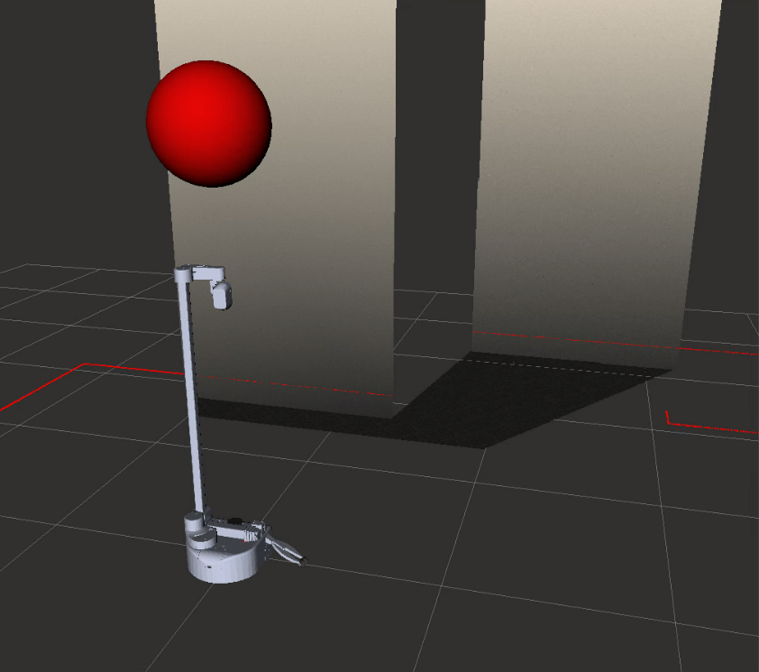
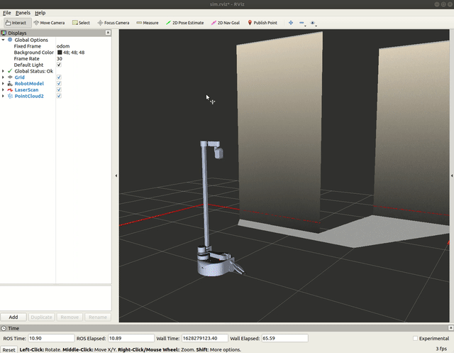

## Example 4




```
python marker.py
```



```python
#!/usr/bin/env python

import rospy
import sys
from visualization_msgs.msg import Marker

class Balloon():
	def __init__(self):
		self.publisher = rospy.Publisher('balloon', Marker, queue_size=10)
		self.marker = Marker()
		self.marker.header.frame_id = '/base_link'
		self.marker.header.stamp = rospy.Time()
		self.marker.type = self.marker.SPHERE
		self.marker.id = 0
		self.marker.action = self.marker.ADD
		self.marker.scale.x = 0.5
		self.marker.scale.y = 0.5
		self.marker.scale.z = 0.5
		self.marker.color.r = 1.0
		self.marker.color.g = 0.0
		self.marker.color.b = 0.0
		self.marker.color.a = 1.0
		self.marker.pose.position.x = 0.0
		self.marker.pose.position.y = 0.0
		self.marker.pose.position.z = 2.0

	def publish_marker(self):
		self.publisher.publish(self.marker)


if __name__ == '__main__':
	rospy.init_node('marker', argv=sys.argv)
	ballon = Balloon()
	rate = rospy.Rate(10)

	while not rospy.is_shutdown():
		ballon.publish_marker()
		rate.sleep()		rate.sleep()
```
