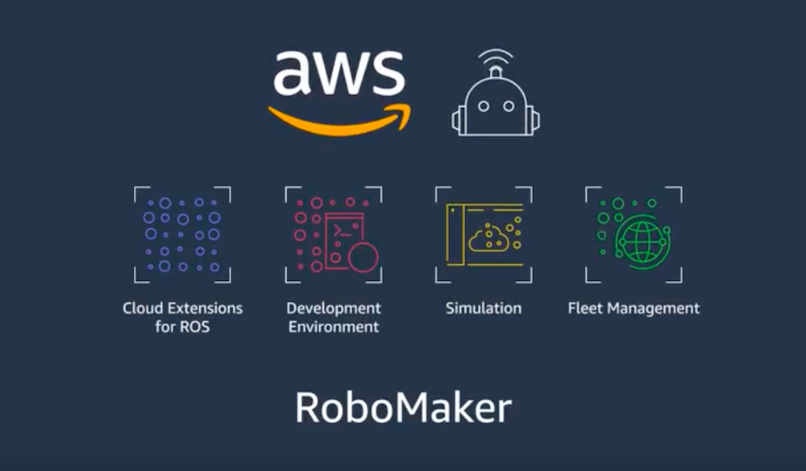

# Getting Started

## Ubuntu

Hello Robot utilizes Ubuntu, an open source Linux operating system, for the Stretch RE1 platform. If you are unfamiliar with the operating system, we encourage you to review a [tutorial](https://ubuntu.com/tutorials/command-line-for-beginners#1-overview) provided by Ubuntu. Additionally, the Linux command line, BASH, is used to execute commands and is needed to run ROS on the Stretch robot. Here is a [tutorial](https://ryanstutorials.net/linuxtutorial/) on getting started with BASH.

## Installing Noetic on Stretch
Instructions on installing Noetic can be found in our open source [installation guide](https://github.com/hello-robot/stretch_ros/blob/dev/noetic/install_noetic.md).

## ROS Setup on Local Computer

Hello Robot is currently running Stretch on Ubuntu 20.04 and on ROS Noetic.  To begin the setup, begin with [installing Ubnutu desktop](https://ubuntu.com/tutorials/install-ubuntu-desktop#1-overview) on your local machine. Then follow the [installation guide for ROS Noetic](http://wiki.ros.org/noetic/Installation/Ubuntu) on your system.

Currently, the Realsense2_description package isn't installed by rosdep and requires a user to manually install the package. Run the following command in your terminal

```bash
sudo apt-get install ros-Noetic-realsense2-camera
```

After your system is setup, clone the [stretch_ros](https://github.com/hello-robot/stretch_ros.git) and [realsense_gazebo_plugin packages]( https://github.com/pal-robotics/realsense_gazebo_plugin) to your preferred workspace. Then install dependencies and build the packages.
```bash
cd ~/catkin_ws/src
git clone https://github.com/hello-robot/stretch_ros
git clone https://github.com/pal-robotics/realsense_gazebo_plugin
cd ~/catkin_ws
rosdep install --from-paths src --ignore-src -r -y
catkin_make
```


Then source your workspace with the following command
```bash
echo "source /home/USER_NAME/catkin_ws/devel/setup.bash"
```

## RoboMaker




If a you are unable to dual boot and install ubuntu on your local machine, an alternative is to use [AWS RoboMaker](https://aws.amazon.com/robomaker/). AWS RoboMaker extends the ROS framework with cloud services. The service provides a robotics simulation service, allowing for testing of the Stretch RE1 platform. If you are a first-time user of AWS RoboMaker, follow the [guide here](https://github.com/aws-robotics/aws-robomaker-robotics-curriculum/blob/main/getting-started-with-aws-robomaker/_modules/mod-2a-aws.md) to get up and running with the service.

**Next Tutorial:** [Gazebo Basics](gazebo_basics.md)
