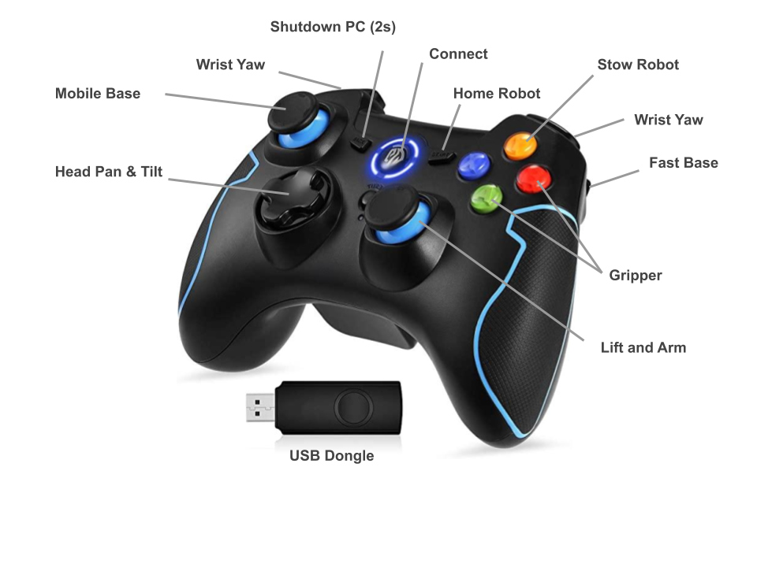

## Teleoperating in Gazebo

First, [startup Stretch in simulation](gazebo_basics.md). Then type the following the command for teleoperating a Stretch robot's mobile base with the keyboard.

```
roslaunch stretch_gazebo teleop_keyboard.launch
```
Below is the keyboard commands that allow a user to move Stretch.  
```
Reading from the keyboard  and Publishing to Twist!
---------------------------
Moving around:
   u    i    o
   j    k    l
   m    ,    .

For Holonomic mode (strafing), hold down the shift key:
---------------------------
   U    I    O
   J    K    L
   M    <    >

t : up (+z)
b : down (-z)

anything else : stop

q/z : increase/decrease max speeds by 10%
w/x : increase/decrease only linear speed by 10%
e/c : increase/decrease only angular speed by 10%

CTRL-C to quit

currently:	speed 0.5	turn 1.0

```

The keyboard teleop node remaps the *cmd_vel* topics to */stretch_diff_drive_controller/cmd_vel*, which the robot takes velocity commands from.

An alternative for robot base teleoperation is to use an xbox controller. Connect the xbox controller device to your local machine either through cable or dongle and run the following command.

```
roslaunch stretch_gazebo teleop_joy.launch
```
Note that the teleop_twist_joy package has a deadman switch by default which disables the drive commands to be published unless it is being pressed. For an Logitech F310 joystick this button is A.

## Teleoperating the Actual Robot



Stretch comes ready to run out of the box. The Xbox Teleoperation demo will let you quickly test out the robot capabilities by teleoperating it with an Xbox Controller.


Note: Make sure the USB Dongle is plugged into the the USB port of the base trunk.

To start the demo:

* Remove the 'trunk' cover and power on the robot
Wait for about 45 seconds. You will hear the Ubuntu startup sound, followed by two beeps (indicating the demo is running).
* Hit the Connect button on the controller. The upper two LEDs of the ring will illuminate.
* Hit the Home Robot button. Stretch will go through its homing calibration routine.
* **Note**: make sure the space around the robot is clear before running the Home function

You're ready to go! A few things to try:

* Hit the Stow Robot button. The robot will assume the stow pose.
* Practice driving the robot around.
* Pull the Fast Base trigger while driving. When stowed, it will make Stretch drive faster
* Manually stop the arm or lift from moving to make it stop upon contact.
* Try picking up your cellphone from the floor
* Try grasping cup from a counter top
* Try delivering an object to a person

If you're done, hold down the Shutdown PC button for 2 seconds. This will cause the PC to turn off. You can then power down the robot.

**Next Tutorial:** [Internal State of Stretch](internal_state_of_stretch.md)
